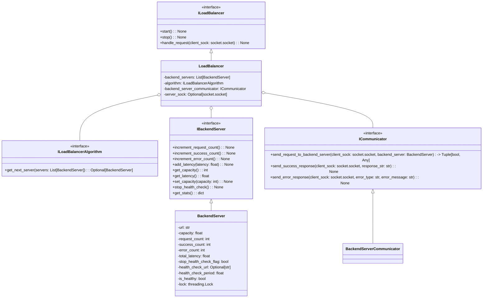

# LoadBalancer

This code provides a basic implementation of a classic load balancer that can handle requests in a distributed system.

It distributes incoming requests to a group of backend servers based on a configured load balancing algorithm.

The Load Balancer starts listening for incoming requests on a specified IP address and port. When a request arrives, the load balancer selects a healthy backend server with the help of configured load balancing algorithm it selects a backend server to handle the request. If there are no healthy backend servers available, the load balancer returns an error response.

Backend servers can handle requests. They keeps track of various statistics such as the number of requests backend server has handled, the number of successful requests, and the number of failed requests. 


### Class Diagram




### Running the Application 
To run this code, follow the steps below:

1. Install the required packages using the command `pip install -r requirements.txt`.
2. Update the configuration: Update the configuration in the `constants/constants.py` file according to your requirements. Specifically, update the `BACKEND_SERVERS_CONFIG` variable with the details of instances of your backend servers.
3. Start instances of backend server.
4.  Start the API server by running the command `python server.py`. The load balancer will start serving on `localhost:8080` by default.

### Running backend servers

We will be needing multiple instances of a backend server on which our load balancer can balance the load. To create multiple instances of a simple server, you can use [gunicorn](https://gunicorn.org/). Follow the steps below:

Steps:
1.  Copy the code given below and paste it in a file with the extension `.py`:

``` python 
from flask import Flask, request

app = Flask(__name__)

@app.route('/', methods=['GET'])
def index():
    #curl http://localhost:8080/
    return 'Hello, world! This is a GET request.'

@app.route('/health', methods=['GET'])
def health():
    return 'OK'

@app.route('/', methods=['POST'])
def post_example():
    #curl -H "Content-Type: application/json" -X POST -d '{"driver_name": "heavydriver","contact_number": "9000000000"}' http://localhost:8080/   
    data = request.get_json()
    return f'Received POST request with data: {data}'

@app.route('/', methods=['PUT'])
def put_example():
    #curl -H "Content-Type: application/json" -X PUT -d '{"driver_name": "heavydriver","contact_number": "9000000000"}' http://localhost:8080/   
    data = request.get_json()
    return f'Received PUT request with data: {data}'

if __name__ == '__main__':
    app.run(debug=True)

``` 
2. Open a new terminal tab and run Gunicorn using the syntax below:
	`gunicorn --log-level=debug <file_name_without_extension>:app --bind <host_name>:<port> --workers <no_of_workers>`
	For example:
		`gunicorn --log-level=debug bs:app --bind localhost:8001 --workers 5`

3. Update the configuration in the `constants/constants.py` file according to step 2.